# Complete System Architecture

> All 3 platforms — React Frontend, Express Backend, Chrome Extension — with every file, component, route, middleware, service, and external integration.

```mermaid
flowchart TB
    subgraph EXT["🧩 CHROME EXTENSION"]
        direction TB
        EXT_MAN["manifest.json<br/>Manifest V3<br/>permissions: storage, alarms, notifications"]
        EXT_POP["popup.js + popup.html + popup.css<br/>Login UI · Stats Display · Open Dashboard"]
        EXT_BG["background.js<br/>Service Worker<br/>Polls /alerts every 1 min<br/>Fires Chrome notifications"]
        EXT_MAN --> EXT_POP
        EXT_MAN --> EXT_BG
    end

    subgraph FE["⚛️ REACT FRONTEND · Vite · Port 8000"]
        direction TB

        subgraph FE_ENTRY["Entry"]
            MAIN["main.jsx<br/>ReactDOM.render"]
            APP["App.jsx<br/>React Router v6<br/>ProtectedRoute · PublicRoute"]
        end

        subgraph FE_CTX["Context & Config"]
            AUTH_CTX["context/AuthContext.jsx<br/>login · signup · magicLinkAuth<br/>sendMagicLink · logout · getToken"]
            USE_AUTH["hooks/useAuth.js<br/>useContext wrapper"]
            API_CFG["config/api.js<br/>VITE_API_URL"]
            SUPA_CFG["config/supabase.js<br/>Supabase browser client"]
        end

        subgraph FE_PUBLIC["Public Pages (No Auth)"]
            PG_LOGIN["Login.jsx<br/>Email/password + Magic Link"]
            PG_SIGNUP["Signup.jsx<br/>OTP verify + Registration"]
            PG_FORGOT["ForgotPassword.jsx<br/>Send reset email"]
            PG_RESET["ResetPassword.jsx<br/>Token-based reset"]
            PG_FB["Feedback.jsx<br/>⭐ Rating + Message form<br/>Route: /b/:businessId"]
            PG_THANK["ThankYou.jsx<br/>Post-submit redirect"]
            PG_AUTHCB["AuthCallback.jsx<br/>Supabase magic link handler"]
        end

        subgraph FE_PROTECTED["Protected Pages (JWT Required)"]
            PG_DASH["Dashboard.jsx<br/>Stats · Feedback list · Search<br/>Reply · Pin · Delete · Filter"]
            PG_ANL["Analytics.jsx<br/>recharts: Line · Bar · Pie · Area<br/>Date range filter"]
            PG_QR["QRCode.jsx<br/>qr-code-styling library<br/>4 styles · Download PNG/SVG"]
            PG_SET["Settings.jsx<br/>Business info · Profile · Logo<br/>External platforms · Password"]
            PG_PRC["Pricing.jsx<br/>Plan display · Usage stats"]
            PG_WEL["Welcome.jsx<br/>Post-login animated welcome"]
        end

        subgraph FE_COMP["Shared Components"]
            LAYOUT["Layout.jsx<br/>Sidebar nav · Top bar<br/>Profile dropdown · Logout"]
            STAR["StarRating.jsx<br/>1-5 star interactive widget"]
            GOOEY["GooeyNav.jsx<br/>Animated nav bar"]
            PROFILE["ProfileCard.jsx<br/>Animated profile display"]
            VFX["Visual Effects<br/>Threads · Lanyard · MeteorShower<br/>FlyingButterfly · CrackEffect<br/>NeuralBackground · Plasma<br/>LightRays · FluidWave · ElectricBorder"]
        end

        MAIN --> APP
        APP --> AUTH_CTX
        AUTH_CTX --> USE_AUTH
        AUTH_CTX --> API_CFG
        AUTH_CTX --> SUPA_CFG
        APP --> FE_PUBLIC
        APP --> FE_PROTECTED
        FE_PROTECTED --> LAYOUT
        PG_FB --> STAR
    end

    subgraph BE["🖥️ EXPRESS BACKEND · Port 8081"]
        direction TB

        subgraph BE_ENTRY["Server Entry"]
            SRV["server.js<br/>Express app · Trust proxy<br/>Mounts all routes under /api"]
        end

        subgraph BE_SEC["🔒 Security Middleware Stack"]
            SEC1["① helmet() — HTTP Security Headers"]
            SEC2["② hpp() — Parameter Pollution Protection"]
            SEC3["③ cors() — Whitelist Origins"]
            SEC4["④ express.json limit: 5mb"]
            SEC5["⑤ sanitizeInputs — XSS/injection prevention"]
            SEC6["⑥ apiLimiter — 100 req/min/IP"]
            SEC1 --> SEC2 --> SEC3 --> SEC4 --> SEC5 --> SEC6
        end

        subgraph BE_MW["Route-Level Middleware"]
            MW_AUTH["middleware/auth.js<br/>authenticate — JWT HS256 verify<br/>generateToken — 1h access<br/>generateRefreshToken — 7d"]
            MW_RATE["middleware/rateLimit.js<br/>authLimiter: 10/15min<br/>feedbackLimiter: 5/min<br/>apiLimiter: 100/min"]
            MW_SAN["middleware/sanitize.js<br/>isValidEmail · isStrongPassword<br/>isSafeUrl · truncate · escapeForEmail"]
        end

        subgraph BE_ROUTES["API Routes"]
            R_AUTH["routes/auth.js — /api/auth<br/>POST /send-otp · /verify-otp<br/>POST /signup · /login · /google<br/>GET /me · POST /forgot-password<br/>POST /reset-password · /change-password<br/>POST /refresh-token"]
            R_BIZ["routes/business.js — /api/business<br/>GET /:id (public) · PUT /:id<br/>POST /validate-review-url<br/>GET /:id/stats · /analytics · /qr<br/>CRUD /:id/platforms<br/>CRUD /:id/external-summaries<br/>GET /:id/alerts · /plan"]
            R_FB["routes/feedback.js — /api/feedback<br/>POST /:businessId (public, 5/min)<br/>GET /:businessId (auth)<br/>POST /:businessId/external<br/>GET /:businessId/ai-summary<br/>POST /:businessId/analyze-url<br/>POST /:id/:fbId/reply<br/>DELETE · PATCH pin · GET export"]
            R_UP["routes/upload.js — /api/upload<br/>POST /avatar (auth, MIME whitelist)<br/>DELETE /avatar (auth)"]
        end

        subgraph BE_SVC["Services"]
            SVC_AI["services/ai.js<br/>Google Gemini 2.0 Flash<br/>analyzeFeedback · analyzeBulkFeedback<br/>analyzeExternalFeedback<br/>fetchAndAnalyzeUrl (SSRF protected)<br/>analyzeBulkSummary"]
            SVC_EM["services/email.js<br/>Nodemailer (SMTP/Gmail)<br/>generateOTP (crypto.randomInt)<br/>sendOTPEmail<br/>sendNegativeFeedbackAlert<br/>sendReplyToCustomer<br/>HTML-escaped templates"]
        end

        SRV --> BE_SEC
        BE_SEC --> BE_ROUTES
        R_AUTH --> MW_AUTH
        R_AUTH --> MW_RATE
        R_AUTH --> MW_SAN
        R_AUTH --> SVC_EM
        R_BIZ --> MW_AUTH
        R_BIZ --> MW_SAN
        R_BIZ --> SVC_AI
        R_FB --> MW_AUTH
        R_FB --> MW_RATE
        R_FB --> MW_SAN
        R_FB --> SVC_AI
        R_FB --> SVC_EM
        R_UP --> MW_AUTH
    end

    subgraph DB["🗄️ SUPABASE CLOUD"]
        direction TB
        SUPA_DB["PostgreSQL Database<br/>Row-Level Security (RLS)"]
        SUPA_AUTH["Supabase Auth<br/>Magic Link OTP"]
        DB_CONN["db/supabase.js<br/>Service role key connection"]

        subgraph TABLES["Database Tables"]
            T_USERS["users"]
            T_BIZ["businesses"]
            T_FB["feedbacks"]
            T_OTP["email_verification_otps"]
            T_RST["password_reset_tokens"]
            T_PLAT["review_platforms"]
        end
    end

    subgraph EXTERNAL["🌐 EXTERNAL SERVICES"]
        GEMINI["Google Gemini AI<br/>Sentiment Analysis"]
        SMTP["SMTP Server (Gmail)<br/>OTP · Alerts · Replies"]
        SUPA_CLOUD["Supabase Cloud<br/>Auth + Database"]
    end

    FE -->|"HTTPS / API calls<br/>JWT in Authorization header"| BE
    EXT_POP -->|"POST /api/auth/login<br/>GET /api/business/:id/stats"| BE
    EXT_BG -->|"GET /api/business/:id/alerts<br/>every 1 minute"| BE
    BE --> DB_CONN --> SUPA_DB
    FE --> SUPA_CFG -->|"signInWithOtp()"| SUPA_AUTH
    SVC_AI -->|"POST generateContent"| GEMINI
    SVC_EM -->|"SMTP send"| SMTP
    PG_AUTHCB -->|"getSession()"| SUPA_AUTH
```

---

## Component File Map

| Platform | File | Role |
|----------|------|------|
| **Frontend** | `main.jsx` | React entry point |
| | `App.jsx` | Router + route guards (ProtectedRoute, PublicRoute) |
| | `context/AuthContext.jsx` | Auth state: login, signup, logout, magicLinkAuth, getToken |
| | `hooks/useAuth.js` | useContext wrapper for AuthContext |
| | `config/api.js` | VITE_API_URL or empty for dev proxy |
| | `config/supabase.js` | Supabase browser client for magic link |
| | `components/Layout.jsx` | App shell — sidebar, top bar, profile dropdown |
| | `components/StarRating.jsx` | Interactive 1-5 star rating widget |
| | `pages/Dashboard.jsx` | Stats, feedback list, search, reply, pin, delete |
| | `pages/Analytics.jsx` | recharts (line, bar, pie, area) with date filtering |
| | `pages/QRCode.jsx` | QR generation (4 styles), download PNG/SVG |
| | `pages/Settings.jsx` | Business info, profile, logo, platforms, password |
| | `pages/Feedback.jsx` | Public feedback form at /b/:businessId |
| | `pages/Login.jsx` | Email/password + magic link |
| | `pages/Signup.jsx` | Registration with OTP verification |
| **Backend** | `server.js` | Express app + 6 security middleware layers |
| | `middleware/auth.js` | JWT HS256 verify, token generation (1h + 7d) |
| | `middleware/rateLimit.js` | 3 rate limiters (API, auth, feedback) |
| | `middleware/sanitize.js` | XSS prevention, SSRF checker, validators |
| | `routes/auth.js` | 11 auth endpoints |
| | `routes/business.js` | 18+ business management endpoints |
| | `routes/feedback.js` | 9 feedback endpoints |
| | `routes/upload.js` | 2 upload endpoints (MIME validated) |
| | `services/ai.js` | Google Gemini 2.0 Flash integration |
| | `services/email.js` | Nodemailer SMTP (OTP, alerts, replies) |
| | `db/supabase.js` | Supabase service-role client |
| **Extension** | `manifest.json` | Chrome Manifest V3 |
| | `popup.js` | Login, stats, open dashboard |
| | `background.js` | Polls alerts every 1 min, Chrome notifications |
