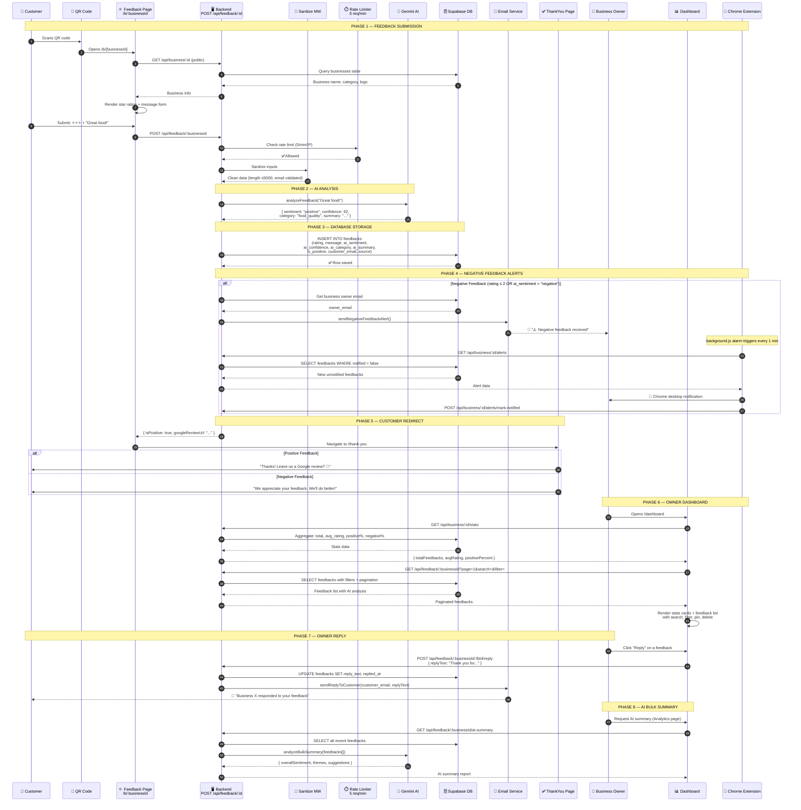

# Data Flow — Feedback Submission to Dashboard

> Complete step-by-step flow from customer scanning a QR code to the business owner viewing and replying on the dashboard.

---

## Data Flow Summary Table

| Phase | From → To | Endpoint | Data Transferred |
|-------|-----------|----------|-----------------|
| **1. Load Form** | Frontend → Backend | `GET /api/business/:id` | Business name, logo, category |
| **2. Submit** | Frontend → Backend | `POST /api/feedback/:businessId` | rating, message, customer_email |
| **3. Rate Limit** | Backend → rateLimit.js | Internal middleware | IP + window check (5/min) |
| **4. Sanitize** | Backend → sanitize.js | Internal middleware | Strip XSS, validate length, check email |
| **5. AI Analysis** | Backend → Gemini API | External HTTP POST | Message text → sentiment, confidence, category |
| **6. Store** | Backend → Supabase | SQL INSERT | Full feedback row with AI fields |
| **7. Alert (neg)** | Backend → Email/Extension | SMTP + Chrome alarm | Alert email + desktop notification |
| **8. Redirect** | Backend → Frontend | HTTP response | isPositive flag + review URL |
| **9. Dashboard** | Frontend → Backend | `GET /stats` + `GET /feedback` | Stats + paginated feedbacks |
| **10. Reply** | Frontend → Backend → Email | `POST /reply` + SMTP | Reply text → customer email |
| **11. AI Summary** | Frontend → Backend → Gemini | `GET /ai-summary` | Bulk feedbacks → summary report |

---

## Files Involved in Data Flow

| Step | Files Used |
|------|-----------|
| QR Scan Landing | `frontend/src/pages/Feedback.jsx`, `components/StarRating.jsx` |
| Feedback Submit | `backend/routes/feedback.js` (POST handler) |
| Rate Limiting | `backend/middleware/rateLimit.js` (feedbackLimiter: 5/min) |
| Input Sanitization | `backend/middleware/sanitize.js` (sanitizeInputs, isValidEmail) |
| AI Analysis | `backend/services/ai.js` (analyzeFeedback, analyzeBulkSummary) |
| Database Storage | `backend/db/supabase.js` → feedbacks table |
| Email Alerts | `backend/services/email.js` (sendNegativeFeedbackAlert) |
| Chrome Alerts | `extension/background.js` (polls /alerts every 1 min) |
| Thank You Page | `frontend/src/pages/ThankYou.jsx` |
| Dashboard View | `frontend/src/pages/Dashboard.jsx` |
| Analytics View | `frontend/src/pages/Analytics.jsx` |
| Reply to Customer | `backend/routes/feedback.js` (POST reply), `services/email.js` |
