# Authentication Flows

> All 5 authentication methods with detailed step-by-step flows, security checks, and data exchanges.

```mermaid
sequenceDiagram
    autonumber
    participant U as 👤 User
    participant FE as ⚛️ Frontend
    participant SUPA_C as 🔑 Supabase Client<br/>config/supabase.js
    participant SUPA_S as ☁️ Supabase Cloud<br/>Auth Service
    participant CB as 🔄 AuthCallback.jsx
    participant CTX as 📦 AuthContext.jsx
    participant API as 🖥️ Backend /api/auth
    participant MW as 🔒 auth.js middleware
    participant DB as 🗄️ Supabase DB
    participant MAIL as 📧 Email (SMTP)

    rect rgb(30, 58, 95)
        Note over U,MAIL: 🔐 FLOW 1: Email/Password Signup with OTP Verification
        U->>FE: Enter email on Signup page
        FE->>API: POST /send-otp {email, businessName}
        API->>API: authLimiter (10 req/15min)
        API->>API: isValidEmail() format check
        API->>API: crypto.randomInt(100000, 999999)
        API->>DB: INSERT email_verification_otps<br/>{email, otp_code, expires_at: +10min}
        API->>MAIL: sendOTPEmail(email, otp)
        MAIL-->>U: 📧 "Your verification code: 847293"
        API-->>FE: "OTP sent" (generic, anti-enumeration)
        U->>FE: Enter 6-digit OTP
        FE->>API: POST /verify-otp {email, otp}
        API->>DB: SELECT FROM email_verification_otps<br/>WHERE email AND NOT expired AND attempts < 5
        API->>DB: INCREMENT attempts
        alt OTP matches
            API->>DB: UPDATE SET verified = true
            API-->>FE: { verified: true }
        else Wrong OTP
            API-->>FE: 400 "Invalid OTP"
        end
        U->>FE: Fill registration form + submit
        FE->>API: POST /signup {email, password, businessName, ownerName, category}
        API->>API: isStrongPassword() — 8+ chars, uppercase, lowercase, number
        API->>DB: Check email not already registered
        API->>API: bcrypt.genSalt(10) + bcrypt.hash(password)
        API->>DB: INSERT users {email, password_hash, owner_name}
        API->>DB: INSERT businesses {name, category, owner_email}
        API->>DB: UPDATE users SET business_id
        API->>MW: generateToken(user) → JWT HS256, exp: 1h, jti: uuid
        API->>MW: generateRefreshToken(user) → JWT, exp: 7d
        API-->>FE: { token, refreshToken, user, business }
        FE->>CTX: sessionStorage.setItem('token', jwt)
        FE->>FE: Navigate → /welcome
    end

    rect rgb(20, 83, 45)
        Note over U,MAIL: 🔐 FLOW 2: Email/Password Login
        U->>FE: Enter email + password on Login page
        FE->>API: POST /login {email, password}
        API->>API: authLimiter (10 req/15min)
        API->>DB: SELECT users WHERE email = ?
        alt User found
            API->>API: bcrypt.compare(password, hash)
            alt Password correct
                API->>MW: generateToken(user) — JWT HS256, 1h, jti
                API->>MW: generateRefreshToken(user) — 7d
                API-->>FE: { token, refreshToken, user, business }
                FE->>CTX: Store token in sessionStorage
                FE->>FE: Navigate → /dashboard
            else Wrong password
                API-->>FE: 401 "Invalid credentials"
            end
        else No user
            API-->>FE: 401 "Invalid credentials" (same message)
        end
    end

    rect rgb(88, 28, 135)
        Note over U,MAIL: 🔐 FLOW 3: Magic Link (Passwordless via Supabase)
        U->>FE: Enter email on Login page, click "Magic Link"
        FE->>CTX: sendMagicLink(email)
        CTX->>SUPA_C: supabase.auth.signInWithOtp({email})
        SUPA_C->>SUPA_S: Request magic link generation
        SUPA_S-->>U: 📧 "Click here to sign in" (magic link)
        U->>CB: Clicks link → /auth/callback#access_token=...
        CB->>SUPA_C: supabase.auth.getSession()
        SUPA_C-->>CB: { user: {email, user_metadata} }
        CB->>CTX: magicLinkAuth({email, name, picture})
        CTX->>API: POST /google {email, name, picture}
        API->>DB: SELECT users WHERE email = ?
        alt User exists in DB
            API->>MW: generateToken(user) — JWT HS256
            API-->>CTX: { token, user, isNewUser: false }
            CTX->>CTX: sessionStorage.setItem('token', jwt)
            CTX-->>CB: Success
            CB->>FE: Navigate → /welcome
        else New user (no account yet)
            API-->>CTX: { needsSignup: true, email }
            CTX-->>CB: needsSignup flag
            CB->>FE: Navigate → /signup (email prefilled)
        end
    end

    rect rgb(127, 29, 29)
        Note over U,MAIL: 🔐 FLOW 4: Password Reset
        U->>FE: ForgotPassword page → enter email
        FE->>API: POST /forgot-password {email}
        API->>API: authLimiter (10 req/15min)
        API->>DB: SELECT users WHERE email = ?
        alt User found
            API->>API: crypto.randomBytes(32).toString('hex')
            API->>DB: INSERT password_reset_tokens<br/>{user_id, token, expires_at: +1h, used: false}
            API->>MAIL: Send reset link with token
            Note over API: Token NOT included in API response
        end
        API-->>FE: "If account exists, link sent" (anti-enumeration)
        U->>FE: Click email link → ResetPassword page with token param
        FE->>API: GET /verify-reset-token?token=xxx
        API->>DB: SELECT FROM password_reset_tokens<br/>WHERE token AND NOT expired AND NOT used
        API-->>FE: { valid: true } or { valid: false }
        U->>FE: Enter new password
        FE->>API: POST /reset-password {token, newPassword}
        API->>API: isStrongPassword() — 8+ chars, mixed case, number
        API->>API: bcrypt.hash(newPassword, salt=10)
        API->>DB: UPDATE users SET password_hash = ?
        API->>DB: UPDATE password_reset_tokens SET used = true
        API-->>FE: "Password reset successful"
        FE->>FE: Navigate → /login
    end

    rect rgb(113, 63, 18)
        Note over U,DB: 🔄 FLOW 5: Token Refresh & Session Persistence
        Note over FE,CTX: On every page load / app mount
        FE->>CTX: useEffect → check stored token
        CTX->>API: GET /me<br/>Authorization: Bearer {token}
        API->>MW: authenticate()
        MW->>MW: jwt.verify(token, secret, { algorithms: ['HS256'] })
        MW->>MW: Check token length ≤ 2048
        alt Token valid (< 1h old)
            API->>DB: SELECT user + business
            API-->>CTX: { user, business } → set state
        else Token expired (> 1h)
            API-->>CTX: 401 TOKEN_EXPIRED
            CTX->>API: POST /refresh-token {refreshToken}
            API->>MW: verifyRefreshToken() — check 7d expiry
            alt Refresh token valid
                API->>MW: generateToken() — new 1h access
                API->>MW: generateRefreshToken() — new 7d refresh
                API-->>CTX: { token, refreshToken }
                CTX->>CTX: Update sessionStorage
            else Refresh expired
                API-->>CTX: 401 "Session expired"
                CTX->>CTX: logout() → clear sessionStorage
                CTX->>FE: Navigate → /login
            end
        end
    end
```

---

## Security Measures per Flow

| Flow | Security Layers |
|------|----------------|
| **Signup + OTP** | Rate limit (10/15min) · Email format validation · OTP max 5 attempts · 10-min expiry · Password strength · bcrypt(10) · JWT with jti |
| **Login** | Rate limit · Anti-enumeration (same error for wrong email/password) · bcrypt compare · JWT token pair |
| **Magic Link** | Supabase managed OTP · Short-lived magic link · Server-side user lookup · JWT generation |
| **Password Reset** | Rate limit · Anti-enumeration · crypto.randomBytes(32) · 1h token expiry · Single-use token · Token NOT in response · Password strength check |
| **Token Refresh** | HS256 pinned · 1h access expiry · 7d refresh expiry · Token length cap (2048) · No fallback secret |

---

## Files Involved

| File | Auth Role |
|------|-----------|
| `frontend/src/pages/Login.jsx` | Login form + magic link button |
| `frontend/src/pages/Signup.jsx` | Registration + OTP verification |
| `frontend/src/pages/ForgotPassword.jsx` | Password reset request form |
| `frontend/src/pages/ResetPassword.jsx` | New password form with token |
| `frontend/src/pages/AuthCallback.jsx` | Supabase magic link redirect handler |
| `frontend/src/context/AuthContext.jsx` | login(), signup(), magicLinkAuth(), sendMagicLink(), logout(), getToken() |
| `frontend/src/config/supabase.js` | Supabase browser client (signInWithOtp) |
| `backend/routes/auth.js` | 11 auth API endpoints |
| `backend/middleware/auth.js` | JWT verify, generateToken, generateRefreshToken |
| `backend/middleware/rateLimit.js` | authLimiter (10 req/15min) |
| `backend/middleware/sanitize.js` | isValidEmail(), isStrongPassword() |
| `backend/services/email.js` | sendOTPEmail(), password reset emails |
| `backend/db/supabase.js` | Database queries for users, OTPs, tokens |
