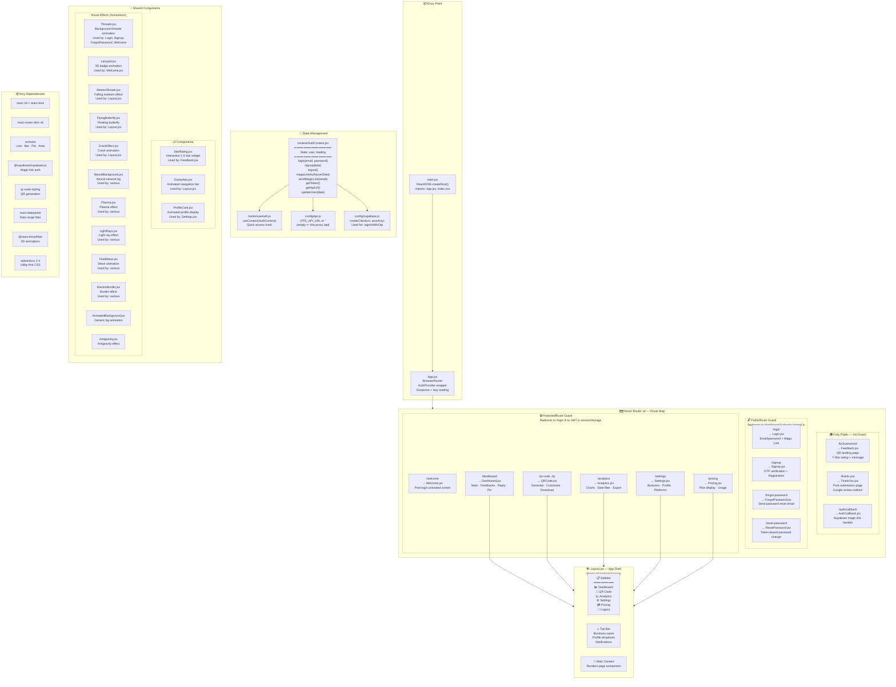

# Frontend Architecture

> React 18 + Vite 5.1 — All routes, page components, shared components, state management, and visual effects.



---

## Route Access Table

| Path | Page Component | Access Level | Lazy Loaded | Layout |
|------|---------------|-------------|-------------|--------|
| `/` | → Redirect to `/login` | Public | — | No |
| `/b/:businessId` | `Feedback.jsx` | **Public (no auth)** | Yes | No |
| `/thank-you` | `ThankYou.jsx` | **Public (no auth)** | No | No |
| `/auth/callback` | `AuthCallback.jsx` | **Public (no auth)** | No | No |
| `/login` | `Login.jsx` | PublicRoute | No | No |
| `/signup` | `Signup.jsx` | PublicRoute | No | No |
| `/forgot-password` | `ForgotPassword.jsx` | PublicRoute | No | No |
| `/reset-password` | `ResetPassword.jsx` | PublicRoute | No | No |
| `/welcome` | `Welcome.jsx` | **ProtectedRoute** | Yes | No |
| `/dashboard` | `Dashboard.jsx` | **ProtectedRoute** | Yes | **Yes** |
| `/qr-code` | `QRCode.jsx` | **ProtectedRoute** | Yes | **Yes** |
| `/qr` | `QRCode.jsx` | **ProtectedRoute** | Yes | **Yes** |
| `/settings` | `Settings.jsx` | **ProtectedRoute** | Yes | **Yes** |
| `/pricing` | `Pricing.jsx` | **ProtectedRoute** | Yes | **Yes** |
| `/analytics` | `Analytics.jsx` | **ProtectedRoute** | Yes | **Yes** |
| `*` | → Redirect to `/login` | — | — | No |

---

## Page Details

| Page | Lines | Key Dependencies | Features |
|------|-------|-----------------|----------|
| **Dashboard** | ~1369 | `useAuth`, `Layout`, `API_URL` | Stats cards (total, avg, positive%, negative%), feedback list with search + filter, reply to customer, pin/unpin, delete, sort by date/rating |
| **Analytics** | ~472 | `useAuth`, `Layout`, `recharts`, `react-datepicker` | Line chart (trend), bar chart (daily), pie chart (sentiment split), area chart (rating distribution), date range filter, CSV export |
| **Feedback** | ~276 | `useParams`, `StarRating`, `API_URL` | Public form: business info display, 1-5 star rating, message textarea (5000 char limit), optional email, submit with loading state |
| **ThankYou** | ~55 | `useLocation`, `Link` | Conditional: positive → Google review link, negative → empathy message |
| **QRCode** | ~555 | `Layout`, `useAuth`, `qr-code-styling` | 4 QR styles (classic, rounded, dots, elegant), color customization, logo embed, download PNG/SVG, copy link |
| **Settings** | ~1042 | `useAuth`, `Layout`, `API_URL` | Business name/category/logo edit, profile photo upload, external platform links, password change, danger zone |
| **Pricing** | ~288 | `Layout`, `useAuth`, `API_URL` | Free vs Premium plan comparison, current usage stats, upgrade CTA |
| **Welcome** | ~137 | `useAuth`, `Threads`, `Lanyard` | Animated welcome screen with 3D badge, auto-redirect to dashboard |
| **AuthCallback** | ~86 | `supabase`, `useAuth` | Extracts session from URL hash, calls magicLinkAuth(), handles new vs existing user |
| **Login** | ~301 | `Threads`, `API_URL`, `useAuth` | Email/password form, "Send Magic Link" button, forgot password link |
| **Signup** | ~920 | `Threads`, `API_URL`, `useAuth` | 3-step: email → OTP verify → registration form (name, business name, category, password) |
| **ForgotPassword** | ~272 | `Threads`, `API_URL` | Email input → send reset link, success message |
| **ResetPassword** | ~357 | `Threads`, `API_URL` | Token validation → new password form → success redirect |

---

## Component Usage Map

```
App.jsx
├── AuthProvider (context/AuthContext.jsx)
│   ├── uses config/api.js
│   └── uses config/supabase.js
│
├── PublicRoute
│   ├── Login.jsx ──── uses Threads.jsx
│   ├── Signup.jsx ──── uses Threads.jsx
│   ├── ForgotPassword.jsx ──── uses Threads.jsx
│   └── ResetPassword.jsx ──── uses Threads.jsx
│
├── Public (no guard)
│   ├── Feedback.jsx ──── uses StarRating.jsx
│   ├── ThankYou.jsx
│   └── AuthCallback.jsx ──── uses supabase.js
│
└── ProtectedRoute
    ├── Welcome.jsx ──── uses Threads.jsx, Lanyard.jsx
    │
    └── Layout.jsx ──── uses MeteorShower, FlyingButterfly, CrackEffect
        ├── Dashboard.jsx
        ├── Analytics.jsx ──── uses recharts
        ├── QRCode.jsx ──── uses qr-code-styling
        ├── Settings.jsx ──── uses ProfileCard.jsx
        └── Pricing.jsx
```

---

## Build & Dev Configuration

| File | Purpose |
|------|---------|
| `vite.config.js` | Dev server port 8000, proxy `/api` → `localhost:8081` |
| `tailwind.config.js` | Content paths, custom theme |
| `postcss.config.js` | Tailwind + autoprefixer plugins |
| `index.html` | SPA entry, mounts `#root` |
| `vercel.json` | Production rewrites (SPA routing) |
| `package.json` | Dependencies, build scripts |
