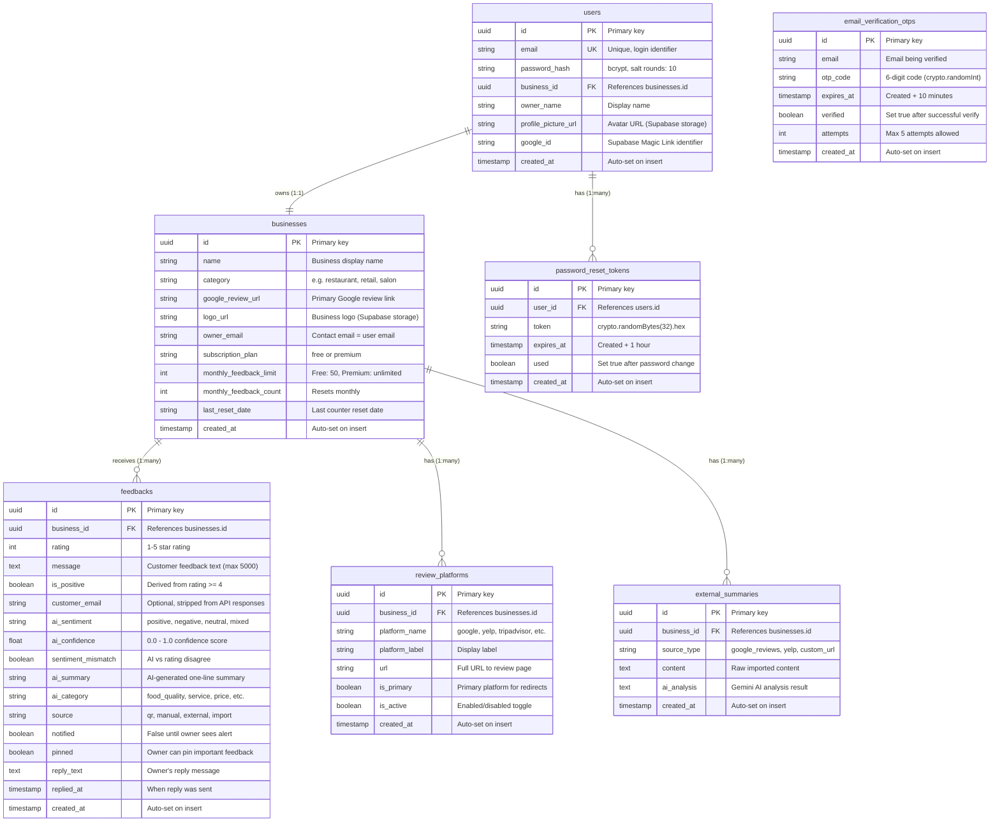

# Database Schema — Supabase PostgreSQL

> 7 tables, their relationships, column details, and usage across the application.

---

## Table Details

### `users` — Business Owner Accounts

| Column | Type | Constraints | Purpose |
|--------|------|------------|---------|
| `id` | UUID | PK, auto | Unique user identifier |
| `email` | VARCHAR | UNIQUE, NOT NULL | Login email, must pass isValidEmail() |
| `password_hash` | VARCHAR | NOT NULL | bcrypt hash (salt rounds: 10) |
| `business_id` | UUID | FK → businesses.id | Links user to their business |
| `owner_name` | VARCHAR | — | Display name |
| `profile_picture_url` | VARCHAR | — | Avatar stored in Supabase Storage |
| `google_id` | VARCHAR | — | Set when user signs in via Magic Link |
| `created_at` | TIMESTAMP | DEFAULT now() | Account creation time |

**Used by:** `routes/auth.js` (signup, login, me, change-password), `routes/upload.js` (avatar)

---

### `businesses` — Business Profiles

| Column | Type | Constraints | Purpose |
|--------|------|------------|---------|
| `id` | UUID | PK, auto | Unique business identifier |
| `name` | VARCHAR | NOT NULL | Display name (max 200 chars) |
| `category` | VARCHAR | — | Business type (restaurant, salon, etc.) |
| `google_review_url` | VARCHAR | — | Primary Google review link |
| `logo_url` | VARCHAR | — | Logo stored in Supabase Storage |
| `owner_email` | VARCHAR | — | Contact email (same as user email) |
| `subscription_plan` | VARCHAR | DEFAULT 'free' | `free` or `premium` |
| `monthly_feedback_limit` | INT | DEFAULT 50 | Free: 50, Premium: unlimited |
| `monthly_feedback_count` | INT | DEFAULT 0 | Incremented per feedback, resets monthly |
| `last_reset_date` | VARCHAR | — | Last monthly counter reset |
| `created_at` | TIMESTAMP | DEFAULT now() | Business creation time |

**Used by:** `routes/business.js` (CRUD, stats, QR, analytics), `routes/feedback.js` (check limits, get owner email)

---

### `feedbacks` — Customer Feedback Entries

| Column | Type | Constraints | Purpose |
|--------|------|------------|---------|
| `id` | UUID | PK, auto | Unique feedback identifier |
| `business_id` | UUID | FK → businesses.id | Which business received this |
| `rating` | INT | 1-5 | Star rating |
| `message` | TEXT | max 5000 chars | Customer message |
| `is_positive` | BOOLEAN | — | `true` if rating ≥ 4 |
| `customer_email` | VARCHAR | — | Optional, validated by isValidEmail(), **stripped from responses** |
| `ai_sentiment` | VARCHAR | — | `positive`, `negative`, `neutral`, `mixed` |
| `ai_confidence` | FLOAT | 0.0-1.0 | AI confidence score |
| `sentiment_mismatch` | BOOLEAN | — | `true` when AI sentiment ≠ rating-based |
| `ai_summary` | VARCHAR | — | AI one-line summary of feedback |
| `ai_category` | VARCHAR | — | AI-detected category (food, service, etc.) |
| `source` | VARCHAR | DEFAULT 'qr' | `qr`, `manual`, `external`, `import` |
| `notified` | BOOLEAN | DEFAULT false | Set `true` after owner sees Chrome notification |
| `pinned` | BOOLEAN | DEFAULT false | Owner can pin important feedback |
| `reply_text` | TEXT | — | Owner's reply to customer |
| `replied_at` | TIMESTAMP | — | When reply was sent |
| `created_at` | TIMESTAMP | DEFAULT now() | Submission time |

**Used by:** `routes/feedback.js` (submit, list, reply, pin, delete, export, AI summary), `services/ai.js` (sentiment analysis)

---

### `review_platforms` — External Review URLs

| Column | Type | Constraints | Purpose |
|--------|------|------------|---------|
| `id` | UUID | PK, auto | Unique platform identifier |
| `business_id` | UUID | FK → businesses.id | Owner's business |
| `platform_name` | VARCHAR | — | `google`, `yelp`, `tripadvisor`, etc. |
| `platform_label` | VARCHAR | — | Display label |
| `url` | VARCHAR | — | Full URL (SSRF-validated by isSafeUrl) |
| `is_primary` | BOOLEAN | DEFAULT false | Primary platform for positive redirects |
| `is_active` | BOOLEAN | DEFAULT true | Enabled/disabled |
| `created_at` | TIMESTAMP | DEFAULT now() | Creation time |

**Used by:** `routes/business.js` (CRUD platforms)

---

### `email_verification_otps` — Signup OTP Codes

| Column | Type | Constraints | Purpose |
|--------|------|------------|---------|
| `id` | UUID | PK, auto | Unique OTP record |
| `email` | VARCHAR | NOT NULL | Email being verified |
| `otp_code` | VARCHAR | NOT NULL | 6-digit OTP (crypto.randomInt, not Math.random) |
| `expires_at` | TIMESTAMP | NOT NULL | Created + 10 minutes |
| `verified` | BOOLEAN | DEFAULT false | Set `true` on successful verification |
| `attempts` | INT | DEFAULT 0 | Max 5 attempts, then rejected |
| `created_at` | TIMESTAMP | DEFAULT now() | OTP generation time |

**Used by:** `routes/auth.js` (send-otp, verify-otp, signup checks)

---

### `password_reset_tokens` — Password Reset

| Column | Type | Constraints | Purpose |
|--------|------|------------|---------|
| `id` | UUID | PK, auto | Unique token record |
| `user_id` | UUID | FK → users.id | User requesting reset |
| `token` | VARCHAR | NOT NULL | crypto.randomBytes(32).toString('hex') |
| `expires_at` | TIMESTAMP | NOT NULL | Created + 1 hour |
| `used` | BOOLEAN | DEFAULT false | Set `true` after password is changed |
| `created_at` | TIMESTAMP | DEFAULT now() | Token generation time |

**Used by:** `routes/auth.js` (forgot-password, verify-reset-token, reset-password)

---

### `external_summaries` — AI Analysis of External Reviews

| Column | Type | Constraints | Purpose |
|--------|------|------------|---------|
| `id` | UUID | PK, auto | Unique summary record |
| `business_id` | UUID | FK → businesses.id | Owner's business |
| `source_type` | VARCHAR | — | `google_reviews`, `yelp`, `custom_url` |
| `content` | TEXT | — | Raw imported review content |
| `ai_analysis` | TEXT | — | Gemini AI analysis output |
| `created_at` | TIMESTAMP | DEFAULT now() | Analysis time |

**Used by:** `routes/business.js` (CRUD external-summaries), `services/ai.js` (analyzeExternalFeedback)

---

## Query Patterns

| Operation | Table(s) | SQL Pattern | Used In |
|-----------|----------|-------------|---------|
| User login | `users` | `SELECT * WHERE email = ?` | `routes/auth.js` POST /login |
| Signup | `users` + `businesses` | `INSERT users` → `INSERT businesses` → `UPDATE users.business_id` | `routes/auth.js` POST /signup |
| Send OTP | `email_verification_otps` | `INSERT {email, otp, expires_at}` | `routes/auth.js` POST /send-otp |
| Verify OTP | `email_verification_otps` | `SELECT WHERE email AND !expired AND attempts < 5` | `routes/auth.js` POST /verify-otp |
| Submit feedback | `feedbacks` + `businesses` | Check limit → `INSERT feedbacks` → `UPDATE count` | `routes/feedback.js` POST /:businessId |
| Get stats | `feedbacks` | `SELECT count, avg(rating), sentiment counts` | `routes/business.js` GET /:id/stats |
| Dashboard list | `feedbacks` | `SELECT * WHERE business_id ORDER BY created_at DESC` | `routes/feedback.js` GET /:businessId |
| Reply | `feedbacks` | `UPDATE SET reply_text, replied_at` | `routes/feedback.js` POST /:id/:fbId/reply |
| Alerts | `feedbacks` | `SELECT WHERE notified = false AND is_positive = false` | `routes/business.js` GET /:id/alerts |
| Password reset | `password_reset_tokens` | `INSERT {user_id, token, expires_at}` | `routes/auth.js` POST /forgot-password |
| Analytics | `feedbacks` | `SELECT date_trunc, counts, aggregate GROUP BY` | `routes/business.js` GET /:id/analytics |

---

## SQL Schema Files

| File | Purpose |
|------|---------|
| `backend/db/supabase_schema.sql` | Main table definitions |
| `backend/db/add_ai_sentiment_columns.sql` | Migration: add AI fields to feedbacks |
| `backend/db/add_customer_email_column.sql` | Migration: add customer_email to feedbacks |
| `backend/db/add_external_summaries.sql` | Migration: create external_summaries table |
| `backend/db/add_pinned_column.sql` | Migration: add pinned to feedbacks |
| `backend/db/add_profile_columns.sql` | Migration: add profile fields to users |
| `backend/db/add_reply_columns.sql` | Migration: add reply_text, replied_at to feedbacks |
